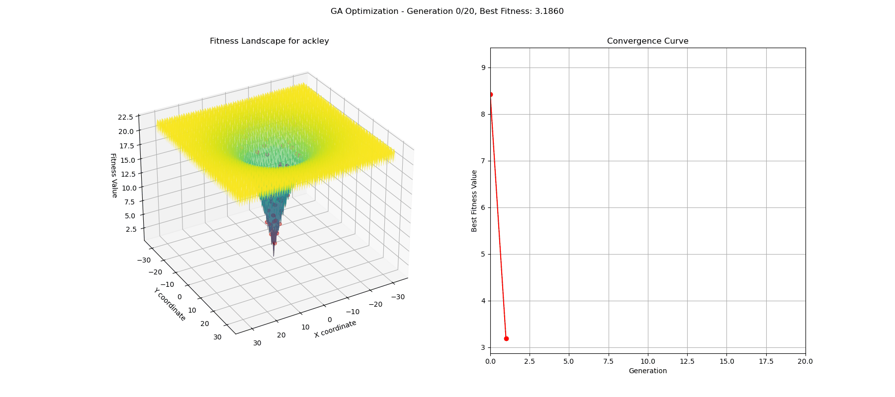

# Genetic Algorithm for Function Optimization with Live Visualization

  

A Python implementation of a Genetic Algorithm (GA) designed to solve complex continuous optimization problems. This repository includes a real-time, interactive dashboard to visualize the entire optimization process, making it an excellent tool for learning, demonstration, and research.

---

## Table of Contents

- [Demonstration](#demonstration)
- [Introduction to Genetic Algorithms](#introduction-to-genetic-algorithms)
- [Algorithm Components](#algorithm-components)
- [Benchmark Function](#benchmark-function)
- [Repository Structure](#repository-structure)
- [Installation](#installation)
- [Usage](#usage)
- [Results and Visualization](#results-and-visualization)
- [License](#license)

## Demonstration

The animation below shows the GA in action. The population of solutions (red dots) explores the 3D landscape of the Ackley function, gradually converging on the global minimum at (0,0). The plot on the right shows the convergence curve, tracking the best fitness found at each generation.



## Introduction to Genetic Algorithms

A Genetic Algorithm is a metaheuristic inspired by the process of natural selection. It belongs to the larger class of Evolutionary Algorithms (EA). GAs are commonly used to generate high-quality solutions to optimization and search problems by relying on bio-inspired operators such as mutation, crossover, and selection.

The algorithm works with a population of candidate solutions (individuals) and iteratively evolves them toward better solutions. At each generation, the fitness of every individual in the population is evaluated. The fittest individuals are stochastically selected from the current population and modified (recombined and possibly mutated) to form a new population, which becomes the current population in the next iteration of the algorithm.

## Algorithm Components

This implementation uses the following standard, well-established methods for each of the core genetic operators:

| Feature           | Implementation Used           | Description                                                                  |
| ----------------- | ----------------------------- | ---------------------------------------------------------------------------- |
| **Selection** | Tournament Selection          | A subset of individuals is chosen randomly, and the fittest one becomes a parent. |
| **Crossover** | Arithmetic Crossover          | Offspring are created by taking a weighted average of the two parents.        |
| **Mutation** | Gaussian Mutation             | A random value from a Gaussian distribution is added to a gene to ensure diversity. |
| **Population** | Continuous                    | Individuals are represented by arrays of floating-point numbers.              |

## Benchmark Function

The algorithm is benchmarked against the **Ackley function**, a common test for optimization algorithms.

- **Characteristics**: Highly multimodal with a nearly flat outer region and a deep central basin containing the global minimum.
- **Challenge**: The many local minima can easily trap simpler optimization algorithms, making it a robust test of an algorithm's ability to balance global exploration and local exploitation.

## Repository Structure

The project is self-contained within a single, well-documented script for simplicity and ease of use.

```
GA_PhD_Project/
├── simple_genetic_algorithm.py    # Simple script with GA logic
├── visual_genetic_algorithm.py    # Visualization script for GA
├── genetic_algorithm.gif          # The demonstration GIF
└── README.md                      # This README file
```

## Installation

1.  Clone the repository:
    ```bash
    git clone [https://github.com/Szymoon/GA_PhD_Project.git](https://github.com/Szymoon/GA_PhD_Project.git)
    cd GA_PhD_Project
    ```

2.  Install the required dependencies:
    ```bash
    pip install numpy matplotlib
    ```

## Usage

Simply run the main script from your terminal:

```bash
python visual_genetic_algorithm.py
```

An interactive window will appear, and the animation will begin.

### Configuration

You can easily configure the Genetic Algorithm's behavior by modifying the hyperparameters at the top of the `simple_genetic_algorithm.py` script:

| Parameter           | Description                                                 |
| ------------------- | ----------------------------------------------------------- |
| `POPULATION_SIZE`   | The number of individuals in each generation.               |
| `GENERATIONS`       | The total number of generations the algorithm will run.     |
| `MUTATION_RATE`     | The probability (0.0 to 1.0) of a gene mutating.            |
| `MUTATION_STRENGTH` | The standard deviation of the noise added during mutation.  |
| `TOURNAMENT_SIZE`   | The number of individuals competing in a selection tournament. |
| `PLOT_DELAY`        | The time in milliseconds between animation frames for the live preview. |

## Results and Visualization

The `visual_genetic_algorithm.py` script produces a live dashboard with two main components:

1.  **3D Animation**: A real-time animation showing the population of solutions moving across the 3D surface of the benchmark function.
2.  **Convergence Plot**: A 2D line graph that plots the best fitness score found at each generation, clearly illustrating the algorithm's performance over time.

## License

This project is licensed under the MIT License. 
